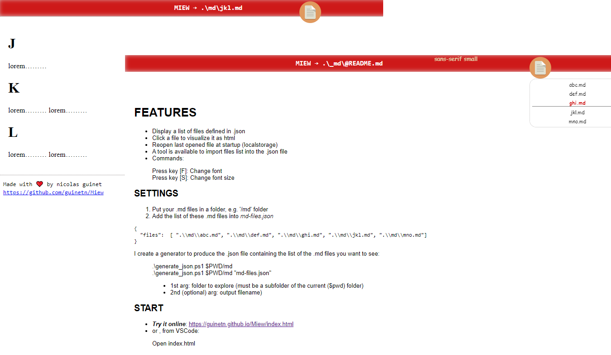

# Miew: Markdowns Viewer

A one click markdown to html file translator. The interface list the available files, enumerated in a simple .json file created
by a succint powershell script.



# FEATURES
- Display a list of files defined in .json
- Click a file to visualize it as html
- Reopen last opened file at startup (localstorage)
- A tool is available to import files list into the .json file
- Commands:
> Press key [F]: Change font  
> Press key [S]: Change font size

## SETTINGS
1. Put your .md files in a folder, e.g. '/md' folder
2. Add the list of these .md files into *md-files.json*  

```json
{ 
  "files":  [ ".\\md\\abc.md", ".\\md\\def.md", ".\\md\\ghi.md", ".\\md\\jkl.md", ".\\md\\mno.md"]
}
```
I create a generator to produce the .json file containing the list of the .md files you want to see:  
>.\generate_json.ps1 $PWD/md  
>.\generate_json.ps1 $PWD/md "md-files.json"   
> * 1st arg: folder to explore (must be a subfolder of the current ($pwd) folder)
> * 2nd (optional) arg: output filename)  

## START

- ***Try it online***: https://guinetn.github.io/Miew/index.html  
- or , from VSCode:  
> Open index.html  
> Click on status bar "Go live", this will run [LiveServer, a VSCode extension](https://marketplace.visualstudio.com/items?itemName=ritwickdey.LiveServer)  

### TECHNICAL NOTES

- **md-files.json** contains the file list (with a relative paths to index.html). It can be generated by ***generate_json.ps1***  

- It use ShowdownJS for the md to html transformation
> [Showdown: A JS Markdown to HTML bidirectional converter](http://showdownjs.com)

- Use github pages hosting, you won't need a server!
